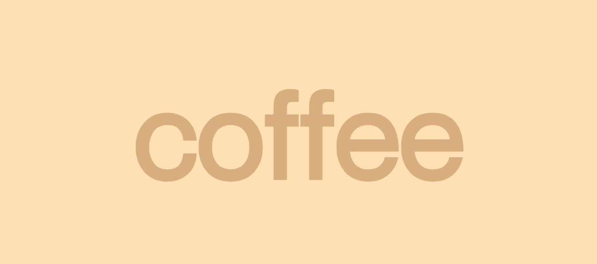

<a href="https://github.com/whosramoss/coffee-boilerplate">
  
  <h1 align="center">Coffee NextJS Boilerplate</h1>
</a>

<p align="center">
  This template provides a starting point for building Next.js apps with amazing animations.
</p>

<div align="center">
  
  
  
  
  
  <br/>
  
  
  
</div>
<br/>
<a href="./docs/coffee-boilerplate.mp4">
  <p align="center">Check the preview</p>
</a>
<br/>


## How to install ⚡

```bash
  # Clone the project
  git clone https://github.com/whosramoss/coffee-boilerplate/

  # Go to the project directory
  cd coffee-boilerplate

  # Install dependencies
  npm install

  # Start the server 
  npm run dev
```

## How to build ⚡
- To generate a static build, you must make the `distDir`, `output`, `trailingSlash` parameters visible in the `next.config.mjs` file 

- Don't forget to set the `isLocalTest` variable to false in `meta.ts`
- run the command:

```bash
  npm run build
```

## Structure 📂

- [src](./src/) – Add all folders below
  - [app](./src/app/) – Contains pages, layouts, and api routes
  - [client](./src/client/) – Contains components, hooks, providers, and styles
  - [server](./src/server/) – Contains schemas and services
  - [shared](./src/shared/) – Contains methods, types, enums and constants that will be used in more than one place in the application

## Features 🦾

- [Next.js](https://nextjs.org/) 
- [TypeScript](https://www.typescriptlang.org/) 
- [Prettier](https://prettier.io/)
- [ESLint](https://eslint.org/) 
- [Tailwind CSS](https://tailwindcss.com/) 
- [Framer Motion](https://framer.com/motion) 
- [Zod](https://zod.dev/) 

## Hooks ⚡
### Animation
- [useAnimationCursor](./src/client/hooks/useAnimationCursor.ts)
- [useAnimationFadeIn](./src/client/hooks/useAnimationFadeIn.ts)
- [useAnimationHoriozontalList](./src/client/hooks/useAnimationHoriozontalList.ts)
- [useAnimationHover](./src/client/hooks/useAnimationHover.ts)
- [useAnimationItemMouseMove](./src/client/hooks/useAnimationItemMouseMove.ts)
- [useAnimationParallax](./src/client/hooks/useAnimationParallax.ts)
- [useAnimationParallaxImage](./src/client/hooks/useAnimationParallaxImage.ts)
- [useAnimationSplash](./src/client/hooks/useAnimationSplash.ts)
- [useAnimationTextScroll](./src/client/hooks/useAnimationTextScroll.ts)

### Others 
- [useApiFetch](./src/client/hooks/useApiFetch.ts)
- [useLocalStorage](./src/client/hooks/useLocalStorage.ts)
- [useMediaQuery](./src/client/hooks/useMediaQuery.ts)
- [useTabs](./src/client/hooks/useTabs.ts)
- [useTimeout](./src/client/hooks/useTimeout.ts)

## API 
[FAKE COFFEE API](https://fake-coffee-api.vercel.app/) : Fake coffee products rest API for your e-commerce or cafe website prototype


## Contributing 📄
If you want to contribute to `coffee-boilerplate`, please make sure to review the [contribution guidelines](https://github.com/whosramoss/coffee-boilerplate/blob/master/CONTRIBUTING.md). This project makes use of [GitHub issues](https://github.com/whosramoss/coffee-boilerplate/issues) for
tracking requests and bugs.

## License 📄

MIT License. [LICENSE](./LICENSE)

## Author ✍️

Gabriel Ramos ([@whosramoss](https://github.com/whosramoss))

